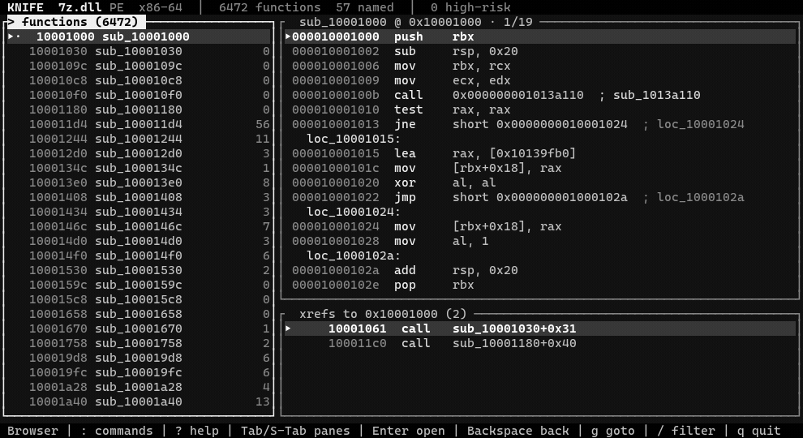

<div align="center">

# knife

**Find the bug, not just the binary.** A reverse engineer's toolkit in Rust.

Parse, triage, disassemble, and audit **PE, ELF, and Mach-O** from one small
binary. Static only: it reads the bytes on disk and never runs the target.

[](https://github.com/bl4ckr0ss3/knife/actions/workflows/ci.yml)
[](https://crates.io/crates/reknife)
[](LICENSE)

[](https://discord.gg/hU5NYVfzd)



[Watch the MP4 demo](assets/demo.mp4)

</div>

## Why

Five tools become one: headers, strings and IOCs, imports, entropy,
disassembly — plus the step they all leave to you. Most tools tell you a binary
imports `memcpy`. `knife` reads the call sites and tells you which one takes
its length from a subtraction:

```text
$ knife sec 7z.dll
  [-] stack cookies (/GS)  disabled   no __security_cookie in the load config
      linear stack overflows reach the saved return address unchecked
  [-] CFG                  disabled   GUARD_CF clear
  WEAK   exposure score 7 · 3 of 6 mitigations missing or weakened

$ knife audit 7z.dll
  § AUDIT (145 FINDINGS)
  [-] copy-underflow   memcpy  sub_1000a6b4     @ 0x1000a72a
      copy length computed by subtraction (integer underflow to a huge size?)
```

Those addresses are real functions in a stripped C++ parser that most
disassemblers never recover: `knife` seeds function discovery from the PE
exception directory (`7z.dll`: 87 → 6472 functions) and ranks dangerous calls
by the argument provenance that reaches them. Same story on a Linux daemon or
a macOS dylib.

## Install

```bash
# from crates.io (installs the `knife` command)
cargo install reknife

# prebuilt binary, no toolchain needed (cargo-binstall)
cargo binstall reknife

# latest from git
cargo install --git https://github.com/bl4ckr0ss3/knife
```

Or grab a prebuilt archive from the
[Releases](https://github.com/bl4ckr0ss3/knife/releases) page and drop `knife`
on your `PATH`.

If your shell cannot find `knife` after installing, `~/.cargo/bin` is not on
your `PATH` yet: restart the shell (or `source ~/.cargo/env` on Unix), then
`knife --version`.

## The TUI

`knife tui FILE` opens a monochrome debugger-style workspace: function list,
listing, cross-references. Bare `knife` opens a file explorer instead —
directories first, PE/ELF/Mach-O badges sniffed from the magic bytes, `/`
filters, Enter opens the workspace, and quitting the workspace returns to the
explorer (`knife tui` without a file and `knife <dir>` do the same).

`?` shows help, `:` opens command mode. The essentials:

| key | does |
|---|---|
| `↵` | open a function, follow the call under the cursor, or jump to a xref |
| `⌫` | back |
| `g` | goto a symbol; `va:0x..` static VA, `off:0x..` file offset |
| `/` | filter the function list, or search the listing |
| `d` / `f` | pseudocode / spatial CFG view |
| `s` | cycle functions, attack surface, driver summary, types |
| `n` / `c` | name / note whatever the cursor is on |
| `b` | bookmark |

Commands worth knowing: `:split` clones the listing into a second column and
`:compare FUNC` pins a function there — Tab walks between the columns, and
each keeps its own cursor, view mode and history; `:only` collapses back.
`:reload` re-reads the target from disk on a background worker; pane layout
and annotations survive, a failed reload keeps the old session.
`:xrefs`, `:callers`, `:callees`, `:imports`, `:exports`, `:strings`,
`:sections`, `:bookmarks`, `:history` open filterable catalogs.
Tab completes commands, Up/Down recalls them.

Your names, notes, bookmarks, patches, types and prototypes save immediately
to a SHA-256-keyed database shared with the CLI — quitting is not a save step.
The database follows the binary, not the path; `--db PATH` relocates it and
`KNIFE_NO_CACHE=1` forces a fresh analysis. The
[milestone plan](docs/terminal-workstation-plan.md) tracks what is stabilized
and what is next.

## Commands

One tool, many jobs, which is the point of a Swiss-army knife:

| command | what you get |
|---|---|
| `knife FILE` | full triage: verdict, hashes, sections, mitigations, capabilities, IOCs, artifacts, entry disasm |
| `knife sec FILE` | exploit mitigations, and what each missing one buys an attacker |
| `knife sinks FILE [--class C] [--all]` | dangerous-API call sites, grouped by bug class |
| `knife audit FILE [--reachable]` | sink call sites whose arguments look exploitable |
| `knife xrefs FILE TARGET` | what references a function, import, or address |
| `knife xrefs FILE --str TEXT` | what references the strings matching `TEXT` |
| `knife paths FILE TARGET [--from F]` | call chains that reach a sink from entry points and exports |
| `knife graph FILE [--from FUNC] [--reachable] [--dot]` | whole-program call graph, optionally rooted or Graphviz-ready |
| `knife graph FILE --func FUNC [--dot]` | one function's control-flow graph as text, JSON, or DOT |
| `knife tui FILE` | interactive: functions, listing, xrefs, split comparison, naming and notes |
| `knife mcp [--file F]` | Model Context Protocol server over stdio (tools for agents) |
| `knife name FILE ADDR NAME` | name an address; every later command uses it |
| `knife note FILE ADDR TEXT` | annotate an address; shows up in the disassembly |
| `knife field FILE --type TYPE OFFSET NAME [--data-type CTYPE]` | define a reusable, optionally typed structure field |
| `knife type FILE --func FUNC BASE TYPE` | bind a pseudocode base to a user type |
| `knife var FILE --func FUNC BASE NAME` | persistently rename a recovered pseudocode variable |
| `knife proto FILE --func FUNC --returns TYPE [--param TYPE ...]` | set an exact persistent function prototype |
| `knife patch FILE [--vaddr ADDR \| --off OFFSET] --bytes HEX` | stage binary edits without modifying the input file |
| `knife patch FILE [--vaddr ADDR \| --off OFFSET] --clear [--len N]` | restore a staged patch run or byte range |
| `knife patch FILE --export PATH [--force]` | atomically write a patched copy of the binary |
| `knife typelib FILE --export PATH` | export reusable layouts for other binaries |
| `knife typelib FILE --import PATH [--replace]` | merge or explicitly replace imported layouts |
| `knife db FILE` | everything you have stored for this binary |
| `knife funcs FILE [--by-refs]` | recover functions via control-flow analysis |
| `knife dis FILE --func NAME` | disassemble a whole function with labels and xrefs |
| `knife dis FILE [--vaddr X \| --off Y] [--count N]` | linear disassembly (x86/x64, AArch64) |
| `knife pseudo FILE --func NAME` | pseudocode view: lifted statements, calls with arguments |
| `knife headers FILE` | ELF file header, raw `e_ident` plus decoded labels |
| `knife segments FILE` | ELF program headers and mapped section indices |
| `knife sections FILE` | sections/segments with per-section entropy bars |
| `knife imports FILE` | imported libs and functions, suspicious APIs flagged |
| `knife exports FILE` | exported symbols |
| `knife caps FILE` | capabilities inferred from the symbol surface |
| `knife strings FILE --min N` | ASCII and UTF-16 strings |
| `knife iocs FILE` | URLs, IPs, domains, emails, wallets, reg keys, paths, defanged |
| `knife hashes FILE` | MD5 / SHA-1 / SHA-256 and imphash |
| `knife drv FILE [--reachable]` | kernel-driver / BYOVD analysis: identity, devices, IRP dispatch, IOCTLs, kernel primitives, signing, loldrivers matches |
| `knife scan FILE` | crypto constants, packer markers, embedded formats |
| `knife map FILE` | whole-file entropy sparkline, packed regions flagged |
| `knife hex FILE --off O --len L` | hex dump |
| `knife ls FILE` | archive (.a/.lib) members |
| `knife completions SHELL` | shell completion script (bash, zsh, fish, powershell, elvish) |
| `knife diff A B` | compare two binaries' functions, imports, sections; exit 1 on any change |

Add `--json` to any analysis command for machine-readable output. `knife FILE`
is shorthand for `knife info FILE`.

## For vulnerability research

Triage asks whether a binary is hostile. Research asks where it can be broken,
and four commands answer that:

**`knife sec` — what am I up against.** Reads the real mitigations, not the
flags: a PE with `DYNAMIC_BASE` set but no `.reloc` still loads at its
preferred base, a `GUARD_CF` flag with an empty guard table checks nothing.
Each finding carries its consequence.

**`knife sinks` — where the surface is.** Matches the binary against a
catalogue grouped by the mistake each API enables — unbounded copies, format
strings, input-sized stack allocation, command execution — then resolves every
hit to concrete call sites: addresses in named functions, not an import list.
On `kernel32.dll` that is 327 call sites across 17 APIs; statically linked
targets work the same way.

**`knife audit` — which ones look actually wrong.** For each catalogued call
it recovers where the interesting argument came from (a bounded backward
data-flow walk) and keeps only the sites whose provenance matches a bug
pattern: a `memcpy` length computed by subtraction, an allocation sized by a
multiply, a `printf` format loaded from memory. Ranked, named, and honest
about paths: when dangerous arithmetic reaches a sink on only some paths, the
finding says so. x86/x64.

**`knife xrefs` / `knife paths` — what reaches what.** Who references a
function, import, address, or string; and the shortest call chains from entry
points and exports down to a sink. Empty results do not establish
unreachability — indirect dispatch is outside this direct graph.

```bash
knife sec ./target                       # what am I up against
knife sinks ./target --class memory      # where could the bug be
knife audit ./target --reachable         # which sites look actually exploitable
knife xrefs ./target --str "/tmp/"       # who builds that path
knife paths ./target system              # can anything reach it
```

`knife graph` exports the recovered edges as a deterministic artifact —
whole-program call graph, a forward-reachable subgraph, or one function's CFG —
as text, JSON, or DOT:

```bash
knife graph driver.sys --reachable
knife graph driver.sys --func DispatchDeviceControl --dot > ioctl-cfg.dot
dot -Tsvg ioctl-cfg.dot -o ioctl-cfg.svg
```

Worked example on a real, shipped binary:
[finding CVE-2017-11882 with knife](docs/case-study-eqnedt32.md) — `sec` shows
the Equation Editor has no mitigations, `audit` flags the font-name copy, and
`dis` confirms it is an `lstrcpy` of attacker data into a stack buffer.

**What you worked out.** Everything above is recomputable from the bytes; what
you understood is not. `knife name` and `knife note` write it down, and every
later command reads it back. Naming an address tells the engine there is a
function there — how you make progress on a stripped binary.

```bash
knife name ./target 0x4017a0 parse_record      # sub_4017a0 is now parse_record
knife note ./target 0x4017c4 "len from packet" # shows up beside the instruction
knife funcs ./target | grep parse_record       # and in every other command
```

## Agents

`knife mcp` serves every analysis above over the
[Model Context Protocol](https://modelcontextprotocol.io), so an agent drives
the same engine the command line does: recover functions, read pseudocode,
rank the dangerous call sites, and write names, notes and prototypes into the
database. Thirty tools; bind a binary once (`knife mcp --file PATH` or the
`open` tool) and nothing after it needs a path. Being static, the server
cannot run the sample it is reading — which is what makes it safe to hand an
agent a piece of malware.

```bash
claude mcp add knife -- knife mcp
```

Full tool table and per-client setup: **[docs/MCP.md](docs/MCP.md)**.

## Kernel drivers & BYOVD

`knife drv FILE` is the driver half of the audit. A `.sys` parses,
disassembles, and decompiles like any other target; this pass turns the
generic surface into the questions a driver review actually asks:

| what | where |
|---|---|
| native-subsystem identity + `DriverEntry` | `driver` header line |
| `\Device\` / `\DosDevices\` names and their xrefs | devices list |
| `IRP_MJ_*` dispatch handlers | "irp dispatch" |
| IOCTL codes decoded as `CTL_CODE`, `METHOD_NEITHER` flagged | "ioctl surface" |
| kernel primitives with call sites: physical-memory maps, arbitrary R/W, driver loaders, registry/process, callbacks | "kernel primitives" |
| Authenticode signers + SHA-1 thumbprints | "signing" |
| SHA-256 match against a bundled loldrivers.io snapshot (2000+ samples) | "known vulnerable driver" |

```bash
knife drv ./sus.sys                 # the whole picture
knife drv ./sus.sys --reachable     # primitives user mode can actually drive
```

In the TUI the driver pane is navigable like the sinks: `s` cycles to it,
`↵` jumps to a call site or device, `w` toggles reachable-only, `3` gates on
severity, `/` filters. The kernel API catalogue feeds `knife sinks` and
`knife audit` too.

## What makes it more than objdump

- **Cross-format, one model.** [goblin](https://github.com/m4b/goblin) parses
  PE/ELF/Mach-O into a single neutral model; every command works on every
  format.
- **A real analysis engine.** Recursive-descent disassembly seeded from the
  entry point and every named symbol, jump-table resolution, basic blocks, CFG,
  xref counting. On `kernel32.dll`: 2605 functions, 1515 named.
- **It finds code control flow cannot reach.** Function discovery from the PE
  exception directory and ELF `.eh_frame_hdr` — the 87 → 6472 jump above.
  Chained unwind entries are continuations, not functions, and are skipped.
- **Imports resolve to names.** `.plt`/GOT and `jmp [IAT]` thunks are followed,
  so call sites read `call strcpy@plt` instead of an anonymous `sub_`.
- **A decompiler engine.** `knife pseudo` lifts to an IR, propagates
  expressions across blocks, eliminates dead stores, rebuilds `if`/`else`,
  `while` and `switch` from dominators, and reads the stack frame as named
  locals and arguments. The CVE-2017-11882 overflow comes out as the single
  line `lstrcpyA(&var_28, arg_8 + 0x1c);`. Conservative types with
  interprocedural argument and return propagation; anything the lifter does
  not model prints verbatim, so the limits stay visible.
- **User types that stick.** Reusable structure layouts, typed fields, scoped
  bindings, exact prototypes, variable aliases — editable in the TUI and the
  CLI, portable between binaries via `knife typelib`:

  ```bash
  knife field sample.exe --type CONTEXT 0x18 length --data-type size_t
  knife type  sample.exe --func parse_packet rcx CONTEXT
  knife proto sample.exe --func parse_packet --returns bool --param "CONTEXT *"
  knife typelib driver-a.sys --export kernel-types.json
  knife typelib driver-b.sys --import kernel-types.json
  ```
- **A safe patch workspace.** Staged bytes are analysis facts: the original
  file is never touched, analysis runs on the staged image, and `--export`
  writes a patched copy atomically.

  ```bash
  knife patch sample.exe --vaddr 0x401234 --bytes "31 c0 90"
  knife dis sample.exe --func verify        # analyzes staged bytes
  knife patch sample.exe --export sample-patched.exe
  ```
- **Constant scanning built in.** `knife scan` fingerprints AES S-boxes
  (generated, not stored), SHA/MD5/CRC32 constants, packer markers, and
  embedded formats.
- **Transparent triage.** The verdict (`CLEAN` / `LOW RISK` / `SUSPICIOUS` /
  `MALICIOUS`) is an additive score where every point is a named signal.
  Concealment and anomaly weigh above raw capability — a system DLL
  legitimately exports powerful APIs. It shows what a binary can do and how it
  is built, and leaves intent to you.

## Examples

```bash
# busiest functions, then read the hot one
knife funcs sample.exe --by-refs
knife dis sample.exe --func sub_401240

# what crypto is this stripped blob doing?
knife scan blob.bin

# pull defanged network indicators as JSON
knife iocs sample.exe --json | jq '.[] | select(.kind=="url").value'
```

## Build from source

```bash
cargo build --release        # target/release/knife
cargo test
```

Needs Rust 1.88 or newer (2021 edition). No system libraries beyond the
platform default; the whole tool, terminal interface included, is pure Rust.

## Community

Questions, triage walkthroughs, and release announcements happen on Discord:
[join the server](https://discord.gg/hU5NYVfzd).

## Contributing

Issues and pull requests are welcome. Please run `cargo fmt`, `cargo clippy`,
and `cargo test` before opening a PR; CI enforces all three across Linux,
macOS, and Windows. See [CONTRIBUTING.md](CONTRIBUTING.md).

## License

MIT. See [LICENSE](LICENSE).
